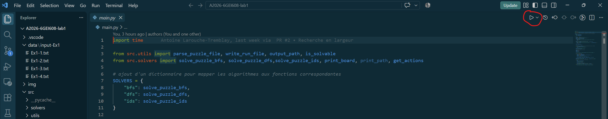
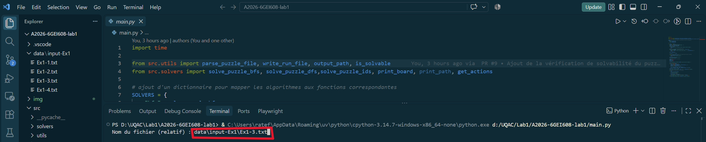
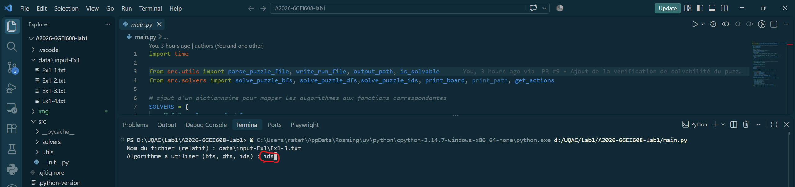
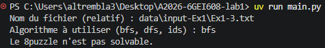

# A2026-6GEI608-lab1

Laboratoire 1 - Algorithmes de recherche non-informée appliqués au 8-puzzle.

## Étapes pour les tests

Ajouter l'extension *Python debugger* depuis l'extension de VS Code

Lancer depuis main.py


Choisir le chemin d'accès du fichier d'input depuis main.py


Choisir l'algorithme de recherche


Taper la touche Entrer

ou

### Installer uv

```bash
# Windows (PowerShell)
powershell -c "irm https://astral.sh/uv/install.ps1 | iex"

# macOS/Linux
curl -LsSf https://astral.sh/uv/install.sh | sh
```

```bash
# Se placer dans le dossier si ce n'est pas déjà le cas
cd C:...\A2026-6GEI608-lab1

# Synchroniser les dépendances
uv sync # Synchronise avec le fichier toml (python 3.14 et dépendances)

# Lancer le programme
uv run main.py

```


## Résumé 

Ce laboratoire nous a fait implémenter trois algorithmes de recherche non informée (recherche en largeur, en profondeur et à approfondissement itératif) pour résoudre le 8-puzzle, puis comparer leurs performances. Pour chacun, nous avons exécuté la recherche 10 fois sur le même input et collecté le temps d'exécution, la taille de la frontière à chaque itération et le nombre total d'états explorés, chaque exécution étant écrite dans son propre fichier.

Nous avons appris qu'un même problème peut se résoudre de façons très différentes selon l'ordre dans lequel on explore les états : la garantie de trouver la meilleure solution, la mémoire utilisée et le temps varient beaucoup d'une stratégie à l'autre. Nous avons aussi appris qu'il faut réfléchir à la représentation des états avant de coder (elle conditionne la simplicité et la vitesse de tout le reste) et qu'il faut savoir détecter les cas sans solution avant de lancer une recherche coûteuse.

## État, actions, objectif et coût de la solution

**États.** Un état est la localisation de chaque nombre sur la grille 3x3, la case vide comprise. Dans notre code, un état est un objet "PuzzleState" qui contient le plateau (liste de listes, "None" pour la case vide), la position "(x, y)" de la case vide, la profondeur (nombre de coups depuis le départ) et le parent (l'état d'où l'on vient). Le parent permet de reconstruire le chemin de la solution à la fin.

**Actions.** Une action consiste à déplacer la case vide vers le haut, le bas, la gauche ou la droite, à condition de rester dans la grille (3*3 dans notre cas). Chaque état a donc entre 2 à 4 successeurs (2 dans les coins, 3 sur les bords, 4 au centre). Dans le code, ces déplacements sont des décalages appliqués à (x, y), et la validité est vérifiée par la fonction is_valid().

**Objectif.** L'état objectif est hardcodé (dans commun.py) et fixe :


1 2 3
4 5 6
7 8 _


Le test du but (is_goal_state()) est une simple comparaison du plateau avec cette configuration.

**Coût de la solution.** Chaque mouvement coûte 1. Le coût d'une solution est donc son nombre de coups et la solution optimale est la plus courte.

## Stratégies de recherche

Les stratégies se distinguent par l'ordre dans lequel elles explorent les états. Pour les comparer, on utilise quatre critères vu dans le cours : la complétude (trouve-t-elle une solution quand il y en a une ?), l'optimalité (trouve-t-elle la plus courte ?), la complexité temporelle et la complexité d'espace. Elles s'expriment avec b (le branchement maximal, ici 4), d (la profondeur de la solution optimale) et m (la profondeur maximale de l'espace d'états).

### Recherche en largeur (BFS)

BFS explore les états niveau par niveau : tous ceux à 1 coup du départ, puis tous ceux à 2 coups, et ainsi de suite. Elle utilise une file (FIFO) : on retire toujours l'état le plus ancien et on ajoute ses voisins à la fin. Pour plus de détails, voir le fichier Fonctionnement BFS.txt

- **Complétude :** oui. Si une solution existe, elle est trouvée.
- **Optimalité :** oui car tous les mouvements coûtent 1 et les niveaux sont explorés dans l'ordre.
- **Temps :** O(b^d). Le nombre d'états explorés grandit avec la profondeur de la solution.
- **Espace :** O(b^d) aussi.On a remarqué que la mémoire grandit vite.
- **Dans nos mesures :** elle retrouve la distance optimale à chaque fois (aux alentours de 25 coups sur les trois inputs résolubles) avec des temps inférieurs à une seconde.

### Recherche en profondeur (DFS)

DFS s'enfonce le plus loin possible dans une branche avant de revenir en arrière. Elle utilise une pile (LIFO) : on retire toujours l'état le plus récemment ajouté. Pareil, voir Fonctionnement DFS.txt pour plus de détails.

- **Complétude :** Dans notre implémentation oui : l'ensemble des états déjà visités empêche de tourner en rond et garanti un espace est fini.
- **Optimalité :** non. Elle retourne la première solution rencontrée qui peut être très longue.
- **Temps :** O(b^m)
- **Espace :** O(b·m) en théorie. Dans notre version avec ensemble des visités, la mémoire grandit avec le nombre d'états rencontrés.
- **Dans nos mesures :** elle est souvent la plus rapide à trouver une solution mais celle-ci est très longue.

### Recherche à approfondissement itératif (IDS)

IDS répète une recherche en profondeur avec une limite l qui augmente de 1 à chaque tour (0, 1, 2, ...). À chaque tour, les états à la profondeur l ne sont pas développés. Elle combine ainsi la faible mémoire du DFS et l'ordre par profondeur croissante du BFS. Voir Fonctionnement IDS.txt pour plus d'informations.

- **Complétude :** oui.
- **Optimalité :** oui car coût uniforme de 1 par coup
- **Temps :** O(b^d)
- **Espace :** O(b·d) en théorie. Dans notre version de code, un dictionnaire des profondeurs visitées est recréé à chaque tour et occupe plus de mémoire que ce minimum théorique.
- **Dans nos mesures :** elle retrouve la distance optimale comme BFS, mais explore plus d'états.

## Défis rencontrés

**Choix de la représentation d'un état.** Nous avons d'abord exploré une représentation sous forme de matrice avec des calculs matriciels comme présenté en cours (par exemple pour représenter les déplacements comme des transformations). Cela s'est avéré beaucoup trop compliqué à notre compréhnsion. Après des recherches, nous avons donc gardé le plateau comme une simple liste de listes, facile à lire et à modifier et utilisé les tuples pour les comparaisons.

**Détecter les états déjà vus.** Une liste de listes n'est pas hachable en Python donc elle ne peut pas être stockée dans un ensemble. Nous avons décidé de convertir le plateau en tuple de tuples uniquement pour la clé de l'ensemble des visités. Le test « déjà vu ? » devient alors en temps constant, ce qui est essentiel avec plusieurs états.

**Copier correctement le plateau.** Pour créer un voisin, il faut copier le plateau avant d'y échanger deux cases. Une copie simple de la liste extérieure ne suffit pas car les lignes restent partagées avec l'état parent : le modifier corromprait alors le parent et tous les états en attente. Nous copions donc chaque ligne séparément pour résodudre ce problème avec [r[:] for r in curr.board] dans chaque algo.

**Correction de l'IDS avec les états visités.** Contrairement à BFS et DFS, on ne peut pas ignorer un état sous prétexte qu'il a déjà été vu car avec une limite de profondeur, un état atteint en profondeur avec peu de marge peut cacher des solutions qu'un chemin plus court aurait permis d'atteindre. Nous conservons donc la plus petite profondeur à laquelle chaque état a été atteint et nous ne le réexplorons que si on y arrive par un chemin plus court.

**Puzzles sans solution.** L'input 3 n'est pas résoluble et IDS ne se terminait jamais durant nos tests alors que BFS et DFS finissaient en moins d'une seconde. La cause est que sans solution, IDS refait une recherche complète pour chaque limite jusqu'à épuiser l'espace.Comme solution, plutôt que d'ajouter un arrêt propre à chaque algorithme, nous avons vérifié la résolubilité AVANT la recherche. Sur une grille 3x3, nous avons trouvé d'après nos recherches qu'un état n'est résoluble que si son nombre d'inversions est pair. Le programme affiche alors un message et s'arrête proprement face à un 8-puzzle irrésolvable.

**Lecture des fichiers d'entrée.** Les fichiers d'entrée peuvent représenter la case vide sous plusieurs formes (cellule vide ou symboles comme *, _, %). Le parseur a été programmé pour soutenir ces "edge cases".

## Comparaison des algorithmes

**Performance.** Sur les inputs résolubles, BFS retrouve toujours la solution optimale, en moins d'une seconde dans nos essais et le temps entre deux instances du meme problème reste similaire.
DFS trouve également une solution sur les inputs résolubles, mais il n'y a pas de garantie d'optimalité. 
IDS retrouve aussi la solution pour les inputs résolubles, mais explore beaucoup plus d'états à cause des ré-explorations.

La disposition initiale des chiffres dans les tuiles peut avantager un algorithme par rapport à un autre, mais il s'agit du fruit du hasard. Par exemple, si le labyrinthe n'a qu'un chiffre a inverser qui se trouve à l'extrémité en largeur, l'algorithme de recherche en profondeur va mettre plus d'itérations avant de le trouver, et vice-versa pour BFS en profondeur. IDS peut avoir à recalculer des états similaires plusieurs fois parce que la solution se trouve à un niveau de profondeur inférieur. 

**Mémoire.** BFS garde un niveau entier de l'arbre en mémoire et c'est son principal inconvénient. DFS et IDS ont en théorie une mémoire proportionnelle à la profondeur seulement. Sur un espace aussi petit, cette différence pèse peu en pratique.

**Facilité d'implémentation.** IDS est le plus facile à écrire une fois le DFS fait, car il reprend exactement sa structure, on ajoute une limite de profondeur l et une boucle externe qui l'augmente. BFS et DFS sont aussi simples, la seule différence étant la structure de données (file ou pile).

**Remarques.** 

Nous avons constaté que l'input Ex1-3.txt est irrésolvable mais bfs et dfs ont réussi à tout explorer les états en moins d'une seconde pour tirer la conclusion qu'aucune solution n'est trouvée.Cependant, ids a pris énormmément de temps qu'on s'est pas rendu à avoir les fichiers de sortie.



Pour un problème de cette taille (8puzzle), BFS est le meilleur choix pratique : optimal, rapide et sans surprise. DFS convient si seule l'existence d'une solution compte. IDS devient intéressant quand l'espace est trop grand pour garder toute la frontière en mémoire. Le cas des puzzles sans solution nous a appris aussi qu'un bon algorithme ne suffit pas, une vérification simple en amont vaut mieux qu'une recherche coûteuse et vaine.

## Fichiers de sorties
Nous avons organisé les informations des fichiers de sorties comme suit (comme mentionné dans l'énoncé):

- À partir de la première ligne : numéro_itération \t taille_de_frontiere
- La ligne avant-dernière du fichier : nombre_global_d_états_explorés
- La dernière ligne : temps d’exécution

## Références utilisées
- « 8 puzzle Problem », GeeksforGeeks, 23 février 2025. [En ligne]. Disponible sur : https://www.geeksforgeeks.org/dsa/8-puzzle-problem-using-branch-and-bound/

- « How to check if an instance of 8 puzzle is solvable? », GeeksforGeeks, 23 juillet 2025. [En ligne]. Disponible sur : https://www.geeksforgeeks.org/dsa/check-instance-8-puzzle-solvable/